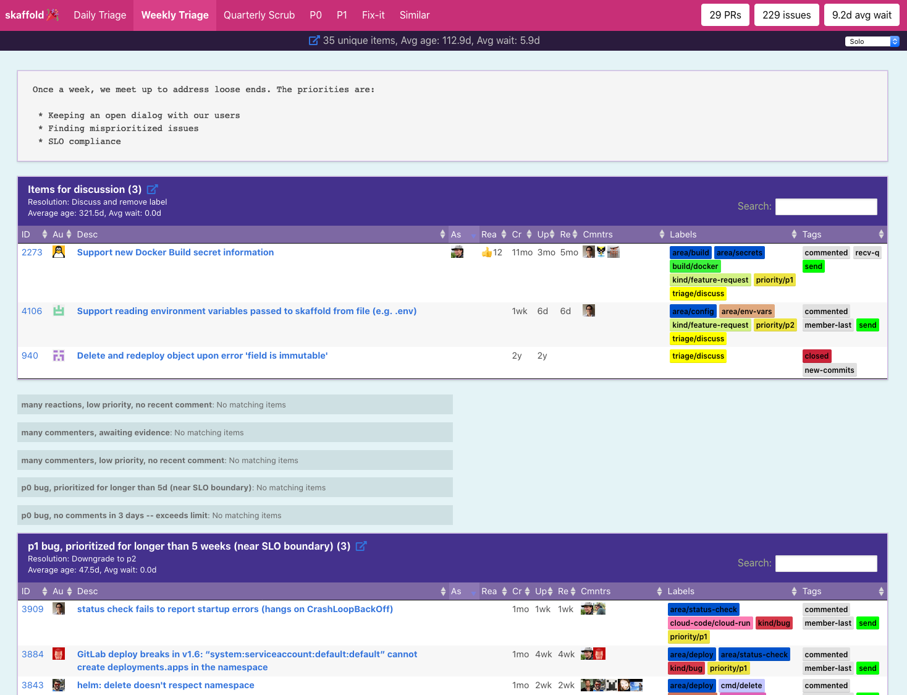

# Triage Party 🎉

`NOTE: This is not an officially supported Google product`

Triage Party is a tool for triaging incoming GitHub issues for large open-source projects, built with the GitHub API.



Triage Party focuses on reducing response latency for incoming GitHub issues and PR's, and ensure that conversations are not lost in the ether. It was built from the [Google Container DevEx team](https://github.com/GoogleContainerTools)'s experience contributing to popular open-source projects, such as [minikube](https://github.com/kubernetes/minikube), [Skaffold](https://github.com/GoogleContainerTools/skaffold/), and [Kaniko](https://github.com/GoogleContainerTools/kaniko/).

Triage Party is a stateless Go web application, configured via YAML. While it has been optimized for Google Cloud Run deployments, it's deployable anywhere due to its low memory footprint: even on a Raspberry Pi.

## Features

* Queries that are not possible on GitHub:
  * conversation state (`tag: recv`, `tag: send`)
  * how long since a project member responded (`responded: +15d`)
  * duration (`updated: +30d`)
  * regexp (`label: priority/.*`)
  * reactions (`reactions: >=5`)
  * comment popularity (`comments-per-month: >0.9`)
  * duplicate detection
  * ... and more!
* Multi-player mode: Supports up to 20 simultaneous players in group triage
* Easily open an entire group of issues into browser tabs (must accept pop-up dialog)
* Queries across multiple repositories
* "Shift-Reload" for live data pull
* GitHub Enterprise support (via `--github-api-url` cli flag)

## Triage Party in production

See these fine examples in the wild:

* [kubernetes/minikube](http://tinyurl.com/mk-tparty)
* [GoogleContainerTools/skaffold](http://tinyurl.com/skaffold-tparty)
* [jetstack/cert-manager](https://triage.build-infra.jetstack.net/)

## Requirements

* [GitHub API token with read access](https://help.github.com/en/articles/creating-a-personal-access-token-for-the-command-line)

## Try it

Store a GitHub token some place on disk:

`echo YOUR_GENERATED_TOKEN > $HOME/.github-token`

Run:

```shell
go run cmd/server/main.go \
  --github-token-file=$HOME/.github-token \
  --config examples/generic-kubernetes.yaml \
  --repos kubernetes/sig-release
```

If you do not have [Go](https://golang.org/) installed, you can run Triage Party using Docker:

```shell
docker build --tag=tp --build-arg CFG=examples/generic-project.yaml .
docker run -e GITHUB_TOKEN=$(cat $HOME/.github-token) -p 8080:8080 tp
```

You'll see logs emitted as Triage Party pulls content from GitHub. The first time a new repository is used, it will require some time (~45s in this case) to download the necessary data before minikube will render pages. Your new Triage Party site is now available at [http://localhost:8080/](http://localhost:8080/), but will initially block page loads until the required content has been downloaded. After the first run, pages are rendered from memory within ~5ms.

## Usage Tips

Triage Party can be configured to accept any triage workflow you can imagine. Here are some tips:


* Use the blue `box-with-arrow` icon to open issues/pull requests into a new tab
  * If nothing happens when clicked, your browser may be blocking pop-ups
  * The notification to allow-popups for Triage Party may be hidden in the URL bar.
* Rules work best when there is a documented resolution to remove it from the list
* Pages work best if the process is defined so that the page is empty when triage is complete
* If an non-actionable issue is shown as part of a daily or weekly triage, step back to tune your rules and/or define an appropriate resolution.

## Multi-player mode


Use the drop-down labelled `Solo` on the top-right of any page to enable multi-player mode. In multi-player mode, the number of issues are split among the number of players you have configured. Since Triage Party is state-less, players are assigned via the remainder of the issue or PR divided by the total number of players. Here is a workflow that we have seen work well for triage parties:

1. Wait for attendees to show up
1. The meeting host selects the appropriate number of players, and shares the resulting Triage Party URL
1. If someone is showing up later, we may leave a slot open and re-shard later if they do not appear
1. The meeting host assigns each attendee a player number
1. Players move section by section, using the "open items in new tabs" feature to quickly work through issues
1. When a player does not have the context necessary to resolve an item, they present their screen and discuss it with the other players
1. When a player leaves, the meeting host "re-shards", and all players select the updated player count in the drop-down

NOTE: Multi-player works best if the "Resolution" field of each rule has a clear action to resolve the item and remove it from the list.

## Data freshness


With the default `Dockerfile`, Triage Party guarantees that all pages are updated at least every 8 minutes, settable using the `--max-refresh` flag. Triage Party will give popular pages a higher refresh rate, up to every 30 seconds by default (settable using `--min-refresh` flag).

Live data can be requested at any time by using forcing a refresh in their browser, typically by holding the Shift button as you reload the page. See   [forced refresh for your browser](https://en.wikipedia.org/wiki/Wikipedia:Bypass_your_cache#Bypassing_cache).

You can see how fresh a pages data is by mousing-over the "unique items" text in the top-center of the page.

## Configuration

YAML-based. See the [configuration guide](docs/config.md).

## Deployments

Triage Party is state-less and designed to be deployable anywhere: see the [deployment guide](docs/deploy.md).
